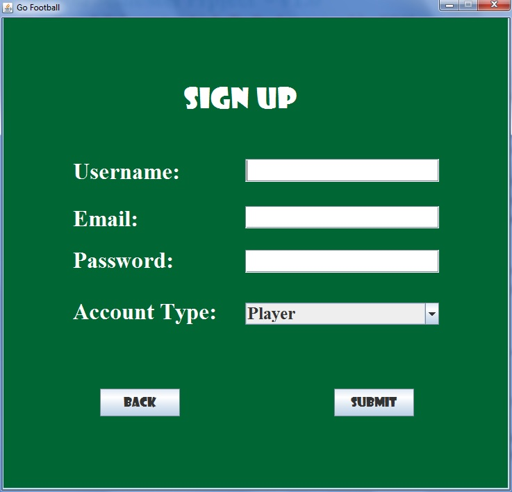
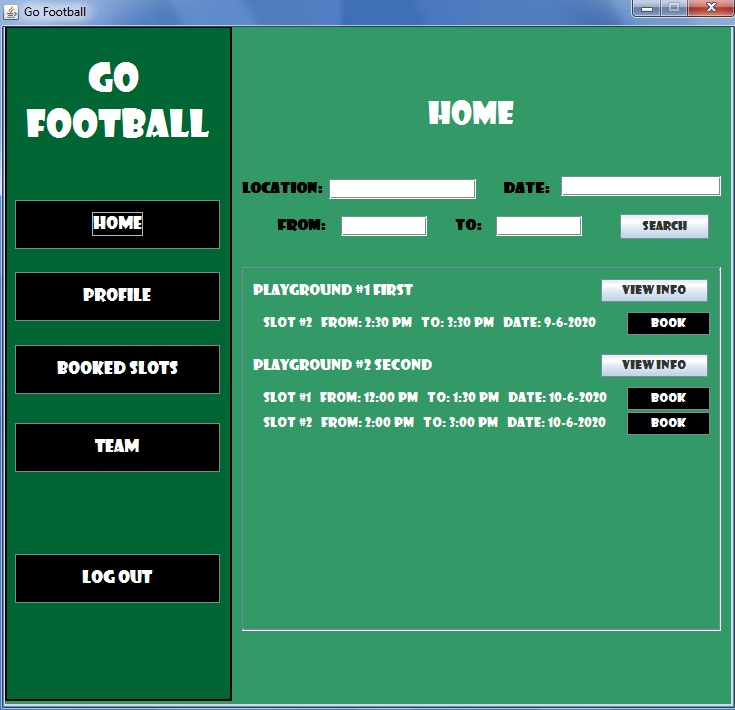
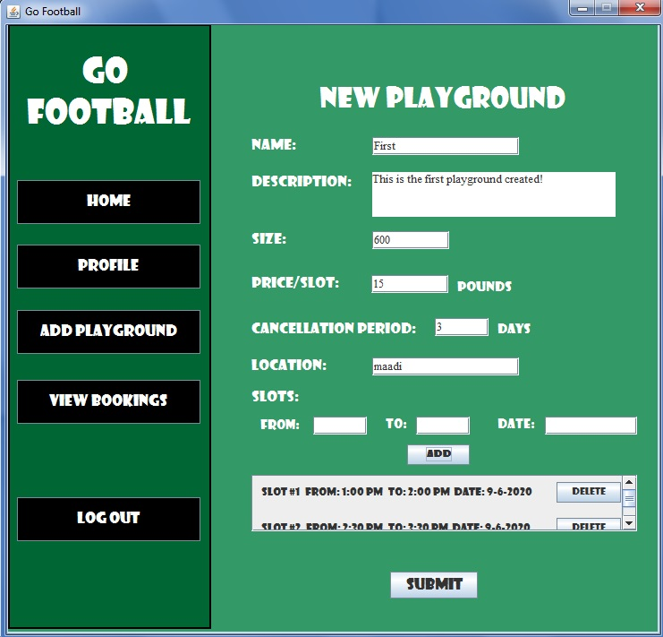
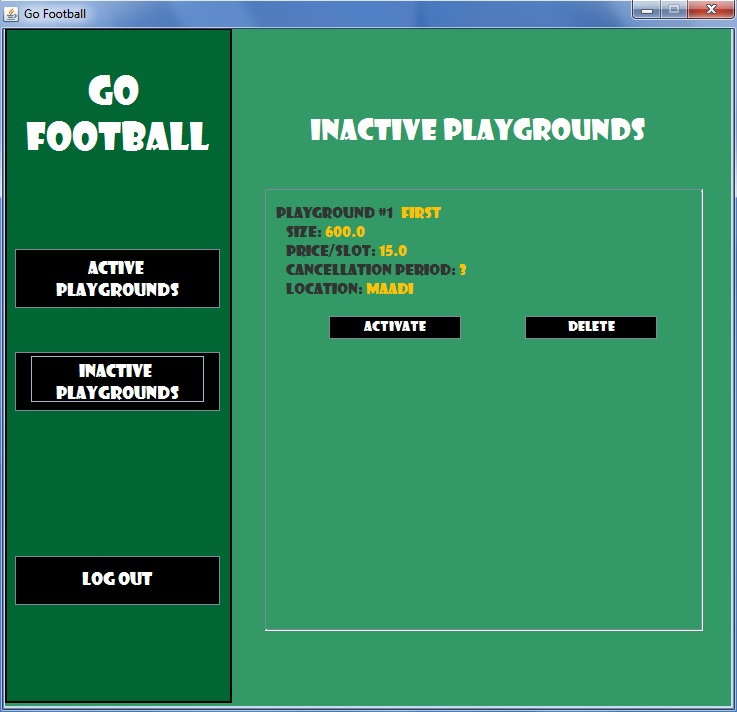

<h1>Go Football</h1>
Go Football (GoFo) is a booking system for football playgrounds. It serves the players and playground owners as well. An administrator oversees the overall operations of the system and ensures that no fraud takes place. Anyone can register themselves on the system and create a profile. They can see the playgrounds near to them or in a specific area or all of the playgrounds.  

Explanation video: https://www.youtube.com/watch?v=-qm5SnbdNaI  

<b>Admin Account:</b>
<ul>
  <li>Email: admin@gofo.com</li>
  <li>Password: admin</li>
</ul>

<h3>Screenshots:</h3>
	
	
	
	  

<b>More screenshots in the SRS document</b>
